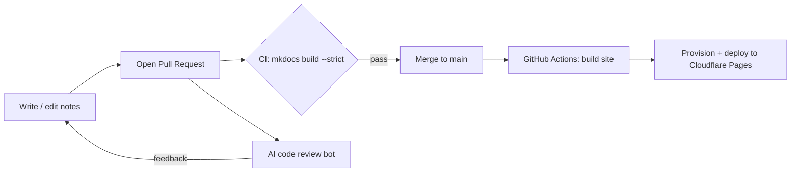
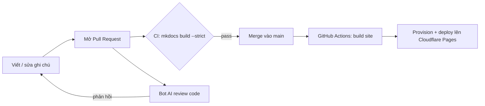

<a id="top"></a>

# My Notes — A Continuously-Deployed Knowledge Base

[](https://github.com/cocvu99/my-notes/actions/workflows/pr-check.yml)
[](https://github.com/cocvu99/my-notes/actions/workflows/deploy.yml)
[](https://squidfunk.github.io/mkdocs-material/)
[](https://pages.cloudflare.com/)
[](https://www.python.org/)

**English** | [Tiếng Việt](#tieng-viet)

> A personal, self-hosted knowledge base where I collect, organize, and continuously
> publish technical study notes — turning "just taking notes" into a real
> **docs-as-code + CI/CD** engineering workflow.

<!-- Live site: add your Cloudflare Pages URL here -->

---

## What is this?

This repository is my growing collection of technical notes on **computer science
fundamentals** — assembled over time from books, official documentation, technical
blogs, online courses, and community groups (Facebook, forums, etc.).

Instead of keeping notes in a private folder, I built it as a **statically generated
documentation site** so I could practice the tooling and automation that real software
teams use every day. It doubles as a sandbox for three things I wanted hands-on
experience with:

1. **Docs-as-code** — writing content in Markdown, versioned in Git, built and
   validated automatically.
2. **AI-assisted code review** — every Pull Request is picked up by automated LLM
   reviewers (Claude, Gemini, …), so I get used to reading, discussing, and acting on
   machine-generated review feedback.
3. **CI/CD & edge deployment** — an end-to-end GitHub Actions pipeline that validates
   every change and ships the site to **Cloudflare Pages**.

The notes cover topics such as **CS fundamentals, algorithms & data structures,
operating systems, networking & security, and system design.**

---

## What this project demonstrates

Even though the *content* is study notes, the *repository* is intentionally built like a
small production project:

- **CI/CD with GitHub Actions** — automated build validation on every PR and automated
  deployment on merge.
- **Static Site Generation** — [MkDocs](https://www.mkdocs.org/) +
  [Material for MkDocs](https://squidfunk.github.io/mkdocs-material/), with math
  rendering (MathJax/KaTeX-style via `pymdownx.arithmatex`), Mermaid diagrams, and
  navigation generated from the folder structure.
- **Edge deployment on Cloudflare Pages** — deployed via Wrangler, including an
  **idempotent provisioning script** that creates the Pages project on first run and
  safely no-ops afterwards.
- **Quality gates** — the site is built in **strict mode** (`mkdocs build --strict`), so
  broken links, missing assets, or bad references *fail the build* before anything is
  merged.
- **AI-in-the-loop reviews** — Pull Requests are automatically reviewed by AI bots
  (Claude wired up through GitHub Actions; and other reviewers such as Gemini).
- **Clean conventions** — [Conventional Commits](https://www.conventionalcommits.org/)
  and a documented contribution standard.

---

## Tech Stack

| Area              | Tools                                                                 |
| ----------------- | --------------------------------------------------------------------- |
| Site generator    | MkDocs + Material for MkDocs                                           |
| Markup / features | Markdown, PyMdown Extensions (superfences, highlight, arithmatex), Mermaid |
| Math rendering    | MathJax (custom config for selectable/copyable equations)             |
| Navigation        | `awesome-pages` plugin (folder-driven nav)                            |
| Language          | Python 3.13                                                           |
| CI/CD             | GitHub Actions                                                        |
| Hosting           | Cloudflare Pages (deployed via Wrangler)                              |
| Code review       | AI review bots on Pull Requests                                       |

---

## How it works (CI/CD pipeline)



- **On every Pull Request** → `pr-check.yml` runs `mkdocs build --strict`. Any broken
  link or missing asset fails the check.
- **On every Pull Request** → `claude-pr-review.yml` runs an automated AI review and
  posts inline comments.
- **On merge to `main`** → `deploy.yml` builds the site, ensures the Cloudflare Pages
  project exists (idempotent provisioning), and deploys.

---

## Repository structure

```
.
├── docs/            # The notes (Markdown), organized by topic
├── src/             # Frontend/UI config (JS, MathJax setup, theme overrides)
├── scripts/         # Automation: dependency install, Cloudflare provisioning
├── .github/
│   └── workflows/   # CI/CD: build validation, AI review, deploy
├── mkdocs.yml       # Site configuration
└── INSTRUCTIONS.md  # Contribution & review conventions
```

---

## Run it locally

Requires **Python 3.13+**.

```bash
# 1. Clone
git clone https://github.com/cocvu99/my-notes.git
cd my-notes

# 2. Install dependencies
bash scripts/install-mkdocs.sh

# 3. Live-preview with hot reload  →  http://127.0.0.1:8000
mkdocs serve

# 4. Production build (strict — same gate as CI)
mkdocs build --strict
```

---

## Contributing conventions

This repo follows a documented standard (see [`INSTRUCTIONS.md`](INSTRUCTIONS.md)):

- **Conventional Commits** — `feat:`, `fix:`, `docs:`, `chore:`, …
- **Strict builds** — code blocks, links, and assets must be valid; the build fails
  otherwise.
- **Wrap code, commands, and config in backticks** for readability.

---

## License / Note

This is a **personal learning project**. The notes are my own compilation of publicly
available knowledge, gathered for self-study.

<br/>

---

<a id="tieng-viet"></a>

# My Notes — Knowledge Base tự động triển khai liên tục

[English](#top) | **Tiếng Việt**

> Một knowledge base cá nhân, tự vận hành — nơi tôi thu thập, sắp xếp và liên tục
> xuất bản các ghi chú kỹ thuật, biến việc "ghi chú" đơn thuần thành một quy trình
> kỹ thuật **docs-as-code + CI/CD** thực thụ.

<!-- Live site: thêm URL Cloudflare Pages của bạn ở đây -->

---

## Đây là gì?

Repo này là bộ sưu tập ghi chú kỹ thuật về **kiến thức nền tảng khoa học máy tính** của
tôi — được tổng hợp dần theo thời gian từ sách, tài liệu chính thức, blog kỹ thuật,
khoá học online và các group cộng đồng (Facebook, forum, v.v.).

Thay vì để ghi chú trong một thư mục riêng, tôi xây dựng nó thành một **trang tài liệu
tĩnh (static site)** để luyện tập bộ công cụ và tự động hoá mà các team phần mềm thực tế
dùng hằng ngày. Đồng thời đây cũng là "sân chơi" để tôi thực hành ba thứ:

1. **Docs-as-code** — viết nội dung bằng Markdown, quản lý version bằng Git, build và
   kiểm thử tự động.
2. **Review code với sự hỗ trợ của AI** — mỗi Pull Request đều được các bot LLM
   (Claude, Gemini, …) tự động review, giúp tôi làm quen với việc đọc, trao đổi và xử lý
   nhận xét do máy tạo ra.
3. **CI/CD & triển khai ở edge** — một pipeline GitHub Actions đầu-cuối, kiểm tra mọi
   thay đổi và deploy site lên **Cloudflare Pages**.

Nội dung ghi chú xoay quanh các chủ đề như **kiến thức nền tảng CS, thuật toán & cấu
trúc dữ liệu, hệ điều hành, mạng & bảo mật, và thiết kế hệ thống (system design).**

---

## Dự án này thể hiện điều gì?

Dù phần *nội dung* là ghi chú học tập, bản thân *repository* được xây dựng có chủ đích
như một dự án nhỏ mang tính production:

- **CI/CD với GitHub Actions** — tự động kiểm tra build ở mỗi PR và tự động deploy khi
  merge.
- **Static Site Generation** — [MkDocs](https://www.mkdocs.org/) +
  [Material for MkDocs](https://squidfunk.github.io/mkdocs-material/), có render công
  thức toán (`pymdownx.arithmatex`), sơ đồ Mermaid, và điều hướng sinh tự động từ cấu
  trúc thư mục.
- **Triển khai ở edge trên Cloudflare Pages** — deploy qua Wrangler, kèm một **script
  provisioning idempotent** tạo project Pages ở lần chạy đầu và tự bỏ qua ở các lần sau.
- **Cổng chất lượng (quality gate)** — site được build ở **chế độ strict**
  (`mkdocs build --strict`), nên link hỏng, thiếu asset hay tham chiếu sai sẽ *làm fail
  build* trước khi được merge.
- **Review có AI trong vòng lặp** — Pull Request được tự động review bởi các bot AI
  (Claude gắn qua GitHub Actions; và các reviewer khác như Gemini).
- **Quy ước gọn gàng** — [Conventional Commits](https://www.conventionalcommits.org/) và
  một chuẩn đóng góp được ghi rõ.

---

## Tech Stack

| Hạng mục            | Công cụ                                                              |
| ------------------- | ------------------------------------------------------------------- |
| Trình tạo site      | MkDocs + Material for MkDocs                                         |
| Markup / tính năng  | Markdown, PyMdown Extensions (superfences, highlight, arithmatex), Mermaid |
| Render toán học     | MathJax (cấu hình cho công thức có thể bôi/copy)                     |
| Điều hướng          | plugin `awesome-pages` (nav theo thư mục)                           |
| Ngôn ngữ            | Python 3.13                                                          |
| CI/CD               | GitHub Actions                                                       |
| Hosting             | Cloudflare Pages (deploy qua Wrangler)                              |
| Review code         | Bot AI review trên Pull Request                                     |

---

## Cách hoạt động (pipeline CI/CD)



- **Ở mỗi Pull Request** → `pr-check.yml` chạy `mkdocs build --strict`. Bất kỳ link hỏng
  hay asset thiếu nào cũng làm fail check.
- **Ở mỗi Pull Request** → `claude-pr-review.yml` chạy review AI tự động và để lại
  comment inline.
- **Khi merge vào `main`** → `deploy.yml` build site, đảm bảo project Cloudflare Pages
  tồn tại (provisioning idempotent) rồi deploy.

---

## Cấu trúc repository

```
.
├── docs/            # Ghi chú (Markdown), sắp xếp theo chủ đề
├── src/             # Cấu hình frontend/UI (JS, thiết lập MathJax, tuỳ biến theme)
├── scripts/         # Tự động hoá: cài dependency, provisioning Cloudflare
├── .github/
│   └── workflows/   # CI/CD: kiểm tra build, review AI, deploy
├── mkdocs.yml       # Cấu hình site
└── INSTRUCTIONS.md  # Quy ước đóng góp & review
```

---

## Chạy trên máy local

Yêu cầu **Python 3.13+**.

```bash
# 1. Clone
git clone https://github.com/cocvu99/my-notes.git
cd my-notes

# 2. Cài dependency
bash scripts/install-mkdocs.sh

# 3. Xem trước với hot reload  →  http://127.0.0.1:8000
mkdocs serve

# 4. Build production (strict — giống hệt CI)
mkdocs build --strict
```

---

## Quy ước đóng góp

Repo tuân theo một chuẩn đã ghi rõ (xem [`INSTRUCTIONS.md`](INSTRUCTIONS.md)):

- **Conventional Commits** — `feat:`, `fix:`, `docs:`, `chore:`, …
- **Build strict** — code block, link và asset phải hợp lệ; nếu không, build sẽ fail.
- **Bọc code, câu lệnh và config trong backtick** cho dễ đọc.

---

## Giấy phép / Ghi chú

Đây là một **dự án học tập cá nhân**. Các ghi chú là phần tổng hợp kiến thức công khai
do tôi tự soạn, phục vụ mục đích tự học.

[↑ Back to top / Về đầu trang](#top)
